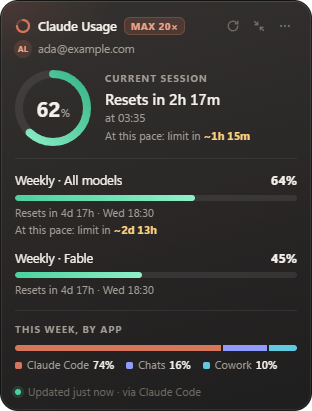
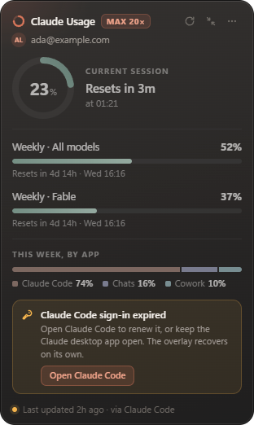
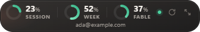

# Claude Usage

A small always-on-top desktop overlay that shows your **Claude plan usage limits**: current
session, weekly limits, per-model weekly limits and this week's split by app. It shows the same
numbers as *Claude → Settings → Usage* and refreshes them automatically. Put it anywhere on any monitor.

Windows · macOS · Linux — Electron + TypeScript.

<p>
  
  
</p>
<p></p>

<sub>Screenshots use mock data.</sub>

## Features

- Frameless, transparent, always-on-top card. Drag it anywhere; its position is remembered, and
  **Move to display** sends it to another monitor.
- Session ring with reset countdown, weekly bars, per-model limits, weekly split by app
  (Claude Code / Chats / Cowork …), and extra-usage credits when enabled.
- Compact pill mode for a minimal footprint: the session plus the weekly limits you pick (menu →
  *Compact mode shows*; all are on by default), with its own refresh button.
- Shows **which account** the numbers belong to: the e-mail Claude Code is signed in with (on the
  card also a Team or Enterprise plan's team name; in the compact pill a small line under the
  rings). Menu → *Show account* hides it, e.g. while you share your screen.
- Tray / menu-bar icon that shows a live ring for your most-constrained limit.
- **Notifications** when a limit reaches 75 %, 90 % and 100 % — once per limit and usage window —
  and, optionally, when it resets (menu → *Notifications*).
- **Pace forecast**: "At this pace: limit in ~1h 15m" under the session (and a weekly limit) when
  your recent usage would hit 100 % before the reset.
- **Lock (click-through)**: clicks go straight to the window underneath, so the overlay never gets
  in the way. Unlock from the tray menu or with the keyboard.
- **Global shortcuts**: `Ctrl+Alt+U` shows/hides the overlay, `Ctrl+Alt+Shift+U` locks/unlocks it
  (`⌘⌥U` / `⌘⌥⇧U` on macOS).
- **Size** 90–150 % and a **Light** theme besides the default dark one (menu → *Size*, *Theme*).
- Refreshes every 3 minutes (1–10 min configurable), plus right after a limit resets.
- Two data sources: **Claude Code**'s sign-in, and the **Claude desktop app**'s own usage history
  as a fallback (no extra sign-in). Menu → *Source* picks *Auto*, *Claude Code only* or
  *Claude Desktop only*; the footer and tray tooltip say where the numbers came from.
- Optional **Launch at login**.
- **Updates itself** from this repository's GitHub Releases: a new version downloads in the
  background and installs when you quit, or right away with *Restart to update* (Windows installer,
  Linux AppImage). The macOS app, the portable exe and the deb package tell you about a new version
  and open its download page.
- Keeps showing the last known data (clearly marked) when you're offline or the sign-in has expired.
- A small diagnostic log with secrets removed (menu → *Open logs folder*).

## How it works

The overlay reads the sign-in that **Claude Code** already stores on your computer. On Windows and
Linux that's `~/.claude/.credentials.json`; on macOS it's the Keychain item `Claude Code-credentials`.
The command-line `claude` and the Claude Code extension for VS Code (which ships its own copy of
Claude Code) both keep their sign-in there, so either one is enough.
It uses that token to ask Anthropic's servers for your usage, the same way the Settings → Usage page
does.

- The token is **only read, never modified or refreshed**. Refreshing would log Claude Code out.
- The token goes only to `api.anthropic.com`. There is no telemetry and no third-party server; the
  only other requests are the update checks to github.com ([Updates](#updates)).
- If Claude Code's sign-in expires (after ~8 h without use), the overlay says so and recovers
  automatically once Claude Code renews it.
- The account it shows (e-mail, name, organization) comes from Claude Code's settings file
  `.claude.json`, which holds no secrets.

**Claude desktop app (fallback).** While it runs, the Claude desktop app writes your plan usage to
`plan-usage-history.json` in its own data folder about every 15 minutes. In *Auto* mode, when
Claude Code's sign-in is missing or expired, the overlay shows the newest sample from that file if
it is at most 20 minutes old ("via Claude Desktop · as of 14:32"). It only reads that one file — no
sign-in, no network — and never touches the desktop app's own sign-in. The file has no reset
times and no weekly split by app, so those parts are left out. The desktop app pauses its
sampling while the computer is idle or locked. Its samples name only an organization, so the
account is shown only when that is Claude Code's organization ("Claude Desktop's account" otherwise).

The overlay never offers a claude.ai sign-in of its own: Anthropic does not allow third-party apps
to offer Claude.ai login or to store claude.ai session tokens.

> The usage endpoint is not an official public API. It can change without notice. This project is
> not affiliated with Anthropic.

## Requirements

- [Claude Code](https://docs.claude.com/en/docs/claude-code) signed in with a Claude Pro/Max/Team
  account — either the Claude Code extension for VS Code, or the `claude` command-line tool
  (`claude`, then `/login`).
- Or the Claude desktop app (Windows / macOS), running: the overlay then shows its recorded usage
  (up to ~20 minutes old, without reset times).
- Node.js 22+ only if you run from source.

## Install

Download the file for your system from the
[Releases page](https://github.com/masoudjaafariwork/Claude-usage/releases). The builds are not
code-signed, so every OS shows a warning the first time.

> **Coming from 0.1.0?** That prerelease was called *Claude Usage Overlay*. From 0.2.0 the app is
> called *Claude Usage* and installs as a separate app: uninstall *Claude Usage Overlay* first
> (Settings → Apps; this also removes its launch-at-login entry). Settings are not carried over.

### Windows 10 / 11

- **Installer** — `Claude-Usage-Setup-<version>.exe`. Installs for your user only (no admin
  rights), adds a Start menu shortcut and starts the overlay. Uninstall from *Settings → Apps*.
- **Portable** — `Claude-Usage-<version>-Portable.exe`. One file, no installation; keep it
  anywhere (e.g. Desktop). It starts a little slower because it unpacks itself on every start.
- SmartScreen may say *"Windows protected your PC"*: click **More info → Run anyway**.

Both versions keep their settings in `%APPDATA%\Claude Usage` (menu → *Open settings
folder*), so they share them. Only one copy runs at a time.

### macOS (Apple Silicon and Intel)

- `Claude-Usage-<version>-arm64.dmg` for Apple Silicon (M1 and later),
  `…-x64.dmg` for Intel Macs. Open it and drag the app to *Applications*.
- The app is ad-hoc signed but not notarized by Apple. On first launch macOS blocks it: open
  **System Settings → Privacy & Security** and click **Open Anyway** (macOS 14 and older: right-click
  the app → *Open*). Or run once in Terminal:
  `xattr -dr com.apple.quarantine "/Applications/Claude Usage.app"`
- The app lives in the menu bar (no Dock icon). When macOS asks for Keychain access, choose
  **Always Allow**.

### Linux (x64)

- **AppImage** — `chmod +x claude-usage-<version>-x86_64.AppImage`, then run it. It needs
  FUSE 2 (`sudo apt install libfuse2t64` on Ubuntu 24.04+, `libfuse2` on older releases). If it
  exits with a sandbox error (Ubuntu 24.04+), start it with `--no-sandbox`.
- **deb** (Debian / Ubuntu) — `sudo apt install ./claude-usage_<version>_amd64.deb`.
- On GNOME the tray icon needs the AppIndicator extension.

### Launch at login

Tick **Launch at login** in the menu. You can also see or switch it off in the OS: *Task Manager →
Startup apps* (Windows), *System Settings → General → Login Items* (macOS), or
`~/.config/autostart/claude-usage.desktop` (Linux). The overlay respects it when you switch
it off there. The option only works in the installed app, not with `npm start`.

### Updates

The app looks for a new version on the
[Releases page](https://github.com/masoudjaafariwork/Claude-usage/releases) 30 seconds after it
starts and then every 6 hours (a small file from github.com; nothing is sent about you).

- **Windows installer and Linux AppImage:** the new version downloads in the background and is
  checked against its SHA-512 hash. When it is ready you get one notification and the menu starts
  with **Restart to update to v…**. Click it to update now, or just keep going — it installs
  quietly the next time you quit. Settings and position stay as they are.
- **macOS, the Windows portable exe and the deb package:** these can't replace themselves (the
  macOS app isn't signed with an Apple Developer ID; the portable exe isn't installed; a deb belongs
  to your package manager). You get a notification, and the menu starts with **Update available
  (v…) — open download page**.
- **Check for updates** (menu, next to *About*) checks right away and tells you the outcome in a
  notification: up to date, downloading, or why the check failed.
- Versions before 0.3.0 have no updater: install 0.3.0 once by hand.

## Run from source

```bash
npm install
npm start
```

- **Move:** drag the card.
- **Menu:** the ⋯ button, right-click, or the tray icon. The menu has show/hide, lock, the data
  source, compact mode and which limits it shows, show account, always on top, size, opacity,
  theme, refresh interval, move to display, reset position, notifications, keyboard shortcuts, the
  settings and logs folders, check for updates, and quit.
- **Keyboard:** `Ctrl+Alt+U` shows/hides the overlay and `Ctrl+Alt+Shift+U` locks/unlocks it from
  any app (`⌘⌥U` / `⌘⌥⇧U` on macOS). Menu → *Keyboard shortcuts* switches them off. To use other
  keys, edit `toggleShortcut` / `lockShortcut` in `settings.json` (menu → *Open settings folder*)
  with the app closed, e.g. `"toggleShortcut": "CommandOrControl+Shift+F9"` (a modifier is
  required). With the overlay focused, `Ctrl` `+` / `-` / `0` or `Ctrl` + mouse wheel change its
  size.
- **Tray:** on Windows/Linux, left-click toggles the overlay. On macOS, click the menu-bar icon.

## Development

| Command | Purpose |
| --- | --- |
| `npm start` | Build and run with real data |
| `npm run start:mock` | Run with fake data |
| `node scripts/start.mjs --mock=critical` | Other scenarios: `normal`, `warning`, `critical`, `expired`, `no-credentials`, `rate-limited`, `offline`, `loading`, `via-desktop`, `desktop-unavailable`, `forecast`, `locked`; add `--theme=light` or `--scale=1.5` to try those |
| `npm run screenshot` | Render every mock scenario (plus light-theme and size variants) to `screenshots/` |
| `npm run screenshot:readme` | Re-render the screenshots at the top of this README (`docs/images/`) |
| `npm run check` | Type-check and run unit tests |
| `npm run dist` | Build installers for the current OS into `release/` (`dist:win`, `dist:mac`, `dist:linux` for one OS) |
| `npm run make-icon` | Regenerate the app icon `build/icon.png` |

Installers are built with [electron-builder](https://www.electron.build/). A dmg must be built on a
Mac and the Linux packages on Linux; the release workflow does all three.

### Releasing a new version

Installed copies update from the **latest published, non-pre-release** GitHub Release and find the
installer through the `latest.yml`, `latest-mac.yml` and `latest-linux.yml` files attached to it.

1. Bump the version (also updates `package-lock.json`) and commit:
   `npm version 0.3.1 --no-git-tag-version`, then
   `git commit -am "chore: release v0.3.1"`.
2. Tag and push: `git push`, then `git tag v0.3.1` and `git push origin v0.3.1`.
3. GitHub Actions ([release.yml](.github/workflows/release.yml)) checks that the tag matches
   `package.json`, runs the tests, builds on Windows, macOS and Linux and attaches everything to a
   **draft** release (10–15 minutes; *Actions* tab).
4. On GitHub → *Releases*, open the draft and check the files: `Claude-Usage-Setup-<v>.exe`,
   `Claude-Usage-<v>-Portable.exe`, two `.dmg`, the `.AppImage`, the `.deb` and **`latest.yml`,
   `latest-mac.yml`, `latest-linux.yml`**. Edit the notes if you like, leave **Set as a
   pre-release** unticked and keep **Set as the latest release** ticked, then **Publish release**.
5. Installed copies find it within 6 hours, or at once via *Check for updates*.

Never delete or replace files of a published release: running copies may be downloading them, and
a changed installer no longer matches the hash in `latest.yml`. Fix a bad release with a new
version instead.

Project guide for AI-assisted development: [CLAUDE.md](CLAUDE.md). Status and decisions:
[docs/PROGRESS.md](docs/PROGRESS.md). Roadmap: [docs/BACKLOG.md](docs/BACKLOG.md).

## Troubleshooting

- **"Not signed in"** (Auto mode): sign in to Claude Code (below) or open the Claude desktop app.
- **"Not signed in to Claude Code"**: sign in from the Claude Code panel in VS Code, or run
  `claude` in a terminal and use `/login`. If you set `CLAUDE_CONFIG_DIR` only in the VS Code
  extension's settings, the overlay can't see it; set it as a user environment variable instead.
- **"Claude Code sign-in expired"**: click **Open Claude Code** in the banner (or the menu). It opens
  a new Claude Code tab in VS Code — or, without the VS Code extension, a terminal running `claude` —
  and Claude Code renews its own token when it starts; the overlay notices within seconds. You don't
  need to type anything. In *Auto* mode an open Claude desktop app fills the gap meanwhile.
- **"No recent data from Claude Desktop"**: the desktop app isn't running, or the computer was idle
  (it doesn't sample then). Open it and use it for a moment; the overlay picks the new sample up
  within seconds.
- **"Couldn't check for updates"**: *No connection to GitHub* — check your connection, VPN or proxy
  (update checks use the system proxy settings too); *No update information on GitHub* — the latest
  release has no `latest*.yml`, or only pre-releases exist. The app tries again after an hour, or
  use *Check for updates*. Details are in the log.
- **Anything else**: menu → *Open logs folder* → `claude-usage.log`. Tokens, cookies and e-mail
  addresses are removed before anything is written, so the log is safe to share.
- **The overlay ignores clicks**: it is locked (a lock icon replaces its buttons). Unlock it from
  the tray menu (*Lock (click-through)*) or press `Ctrl+Alt+Shift+U`.
- **No notifications**: menu → *Notifications* → *Send a test notification*. If nothing appears,
  check Focus Assist / Do not disturb and the OS notification settings for *Claude Usage*
  (macOS asks for permission the first time). On Windows, notifications from `npm start` show
  properly only when the app has been installed once (its Start menu shortcut registers the name).
- **A shortcut doesn't work**: menu → *Keyboard shortcuts* says "in use by another app" when
  another program owns the keys; pick others in `settings.json`. On Linux under Wayland global
  shortcuts aren't available. On keyboard layouts where AltGr is Ctrl+Alt, `Ctrl+Alt+U` can block
  an AltGr character — change or disable the shortcut.
- **"Can't reach Anthropic"**: requests use your system proxy settings. Check your connection or VPN.
- **macOS Keychain prompt**: choose *Always Allow* so the overlay can read Claude Code's sign-in.
- **Linux (GNOME)**: the tray icon needs the AppIndicator extension. On Wayland, always-on-top and
  window positioning depend on the compositor.

## License

[MIT](LICENSE)
