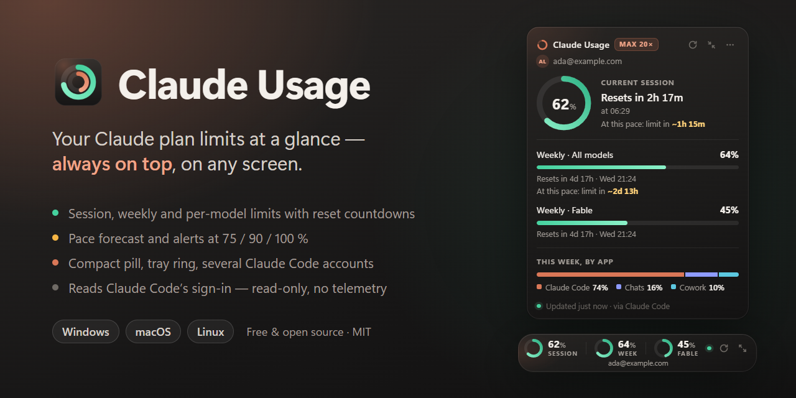

# Claude Usage

A small always-on-top desktop overlay that shows your **Claude plan usage limits**: current
session, weekly limits, per-model weekly limits and this week's split by app. It shows the same
numbers as *Claude → Settings → Usage* and refreshes them automatically. Put it anywhere on any monitor.

It needs no sign-in of its own: it reads the sign-in Claude Code already keeps on your computer
(read-only), or the Claude desktop app's usage history. Nothing set up yet? One button installs
Claude Code with Anthropic's own installer and signs it in through your browser. No claude.ai
login in the app, no telemetry.

Windows · macOS · Linux — Electron + TypeScript. **Website:**
[masoudjaafariwork.github.io/Claude-usage](https://masoudjaafariwork.github.io/Claude-usage/)

<p></p>

<sub>Screenshot uses mock data.</sub>

## Features

- Frameless, transparent, always-on-top card. Drag it anywhere, right up to the screen edge; its
  position is remembered, and **Move to display** sends it to another monitor.
- **Virtual desktops of its own** (one monitor?): menu → *Show on desktops…* puts the overlay on just
  the desktops you tick, so it doesn't cover your work — switch to one of them to see your usage. Each
  account's window can have its own desktops. By default it is on every desktop
  ([below](#virtual-desktops)).
- Session ring with reset countdown, weekly bars, per-model limits, weekly split by app
  (Claude Code / Chats / Cowork …), and extra-usage credits when enabled.
- Compact pill mode for a minimal footprint: the session plus the weekly limits you pick (menu →
  *Compact mode shows*; all are on by default), with its own refresh button.
- Shows **which account** the numbers belong to: the e-mail Claude Code is signed in with (on the
  card also a Team or Enterprise plan's team name; in the compact pill a small line under the
  rings). Menu → *Show account* hides it, e.g. while you share your screen.
- **Several Claude Code accounts**: if you keep each account in its own Claude Code config folder
  (`CLAUDE_CONFIG_DIR`, e.g. one VS Code per account), add the folders in menu → *Claude Code
  account* and switch between them — or give each account **a window of its own** and see them all
  at once, closing any one on its own ([below](#several-claude-code-accounts)).
- Tray / menu-bar icon with a live ring for your most-constrained limit; its tooltip lists your
  limits (on macOS the percentage also sits next to the icon).
- **Notifications** when a limit reaches 75 %, 90 % and 100 % — once per limit and usage window —
  and, optionally, when it resets (menu → *Notifications*). Clicking one brings up the overlay.
- **Pace forecast**: "At this pace: limit in ~1h 15m" under the session (and a weekly limit) when
  your recent usage would hit 100 % before the reset.
- **Lock (click-through)**: clicks go straight to the window underneath, so the overlay never gets
  in the way. Unlock from the tray menu or with the keyboard.
- **Global shortcuts**: `Ctrl+Alt+U` shows/hides the overlay, `Ctrl+Alt+Shift+U` locks/unlocks it
  (`⌘⌥U` / `⌘⌥⇧U` on macOS).
- **Size** 90–150 % (menu → *Size*, or `Ctrl` `+` / `-` / mouse wheel over the overlay) and a
  **theme**: dark (default), light, or the same as your system (menu → *Theme*).
- **Opacity** 50–100 %: a see-through overlay fades to fully opaque while the mouse is over it, and
  back when the mouse leaves.
- Refreshes every 3 minutes (1–10 min configurable), right after a limit resets, and when the
  computer wakes up or is unlocked; the refresh button does it at once.
- Two data sources: **Claude Code**'s sign-in, and the **Claude desktop app**'s own usage history
  as a fallback (no extra sign-in). Menu → *Source* picks *Auto*, *Claude Code only* or
  *Claude Desktop only*; the footer and tray tooltip say where the numbers came from.
- Optional **Launch at login**.
- **Updates itself** from this repository's GitHub Releases: a new version downloads in the
  background and installs when you quit, or right away with *Restart to update* (Windows installer,
  Linux AppImage). The macOS app, the portable exe and the deb package tell you about a new version
  and open its download page.
- Keeps showing the last known data (clearly marked) when you're offline or the sign-in has expired.
- **Sign in with one button**: *Sign in* (or *Install Claude Code* when it isn't installed) opens a
  terminal where your own Claude Code signs in through your browser; the numbers appear as soon as
  it's done. *Add account (sign in)…* adds another Claude account the same way, in a window of its
  own ([below](#signing-in)).
- **Keeps the sign-in fresh**: when an account's Claude Code sign-in expires because you haven't
  used Claude Code for a while, the overlay lets Claude Code renew it in the background — no prompt
  is sent, and you don't have to open Claude Code. **Open Claude Code** remains in the banner as the
  manual way.
- A small diagnostic log with secrets removed (menu → *Open logs folder*).

## How it works

The overlay reads the sign-in that **Claude Code** already stores on your computer. On Windows and
Linux that's `~/.claude/.credentials.json`; on macOS it's the Keychain item `Claude Code-credentials`.
The command-line `claude` and the Claude Code extension for VS Code (which ships its own copy of
Claude Code) both keep their sign-in there, so either one is enough.
It uses that token to ask Anthropic's servers for your usage, the same way the Settings → Usage page
does.

- The token is **only read, never modified or refreshed** by the overlay. Refreshing would log
  Claude Code out.
- The token goes only to `api.anthropic.com`. There is no telemetry and no third-party server; the
  only other requests are the update checks to github.com ([Updates](#updates)).
- If Claude Code's sign-in expires (after ~8 h without use), Claude Code renews it itself — the
  overlay starts it for that in the background ([Signing in](#signing-in)) and recovers within
  seconds.
- The account it shows (e-mail, name, organization) comes from Claude Code's settings file
  `.claude.json`, which holds no secrets.
- With `CLAUDE_CONFIG_DIR` (an account in its own folder) Claude Code keeps both files in that
  folder — on macOS the sign-in is the Keychain item `Claude Code-credentials-<hash of the folder>`.
  The overlay reads whichever account you pick (see
  [Several Claude Code accounts](#several-claude-code-accounts)).

**Claude desktop app (fallback).** While it runs, the Claude desktop app writes your plan usage to
`plan-usage-history.json` in its own data folder about every 15 minutes. In *Auto* mode, when
Claude Code's sign-in is missing or expired, the overlay shows the newest sample from that file if
it is at most 20 minutes old ("via Claude Desktop · as of 14:32"). It only reads that one file — no
sign-in, no network — and never touches the desktop app's own sign-in. The file has no reset
times and no weekly split by app, so those parts are left out. The desktop app pauses its
sampling while the computer is idle or locked. The desktop app has a single sign-in and its samples
name only an organization, so in *Auto* they are used only when that is the organization of the
Claude Code account you're looking at — never another account's numbers. (With *Claude Desktop
only* they are always shown, labelled "Claude Desktop's account" when the organization differs.)

The overlay never offers a claude.ai sign-in of its own: Anthropic does not allow third-party apps
to offer Claude.ai login or to store claude.ai session tokens. Signing in always happens in Claude
Code's own sign-in, in your browser ([Signing in](#signing-in)).

> The usage endpoint is not an official public API. It can change without notice. This project is
> not affiliated with Anthropic.

## Requirements

- [Claude Code](https://docs.claude.com/en/docs/claude-code) signed in with a Claude Pro, Max, Team
  or Enterprise account — either the Claude Code extension for VS Code (or Cursor, Windsurf,
  VSCodium), or the `claude` command-line tool. Not installed yet? The overlay's **Install Claude Code** button runs
  Anthropic's installer for you and signs in ([Signing in](#signing-in)). The free plan doesn't
  include Claude Code.
- Or the Claude desktop app (Windows / macOS), running: the overlay then shows its recorded usage
  (up to ~20 minutes old, without reset times).
- Node.js 22+ only if you run from source.

## Install

Download the file for your system from the
[Releases page](https://github.com/masoudjaafariwork/Claude-usage/releases). The builds are not
code-signed, so every OS shows a warning the first time.

**Tested on Windows 11.** The macOS and Linux builds are made by the same release workflow but
haven't been tried on a real Mac or Linux machine yet — if something doesn't work there, please
open an issue.

> **Coming from 0.1.0?** That prerelease was called *Claude Usage Overlay*. From 0.2.0 the app is
> called *Claude Usage* and installs as a separate app: uninstall *Claude Usage Overlay* first
> (Settings → Apps; this also removes its launch-at-login entry). Settings are not carried over.

### Windows 10 / 11

- **Installer** — `Claude-Usage-Setup-<version>.exe`. Installs for your user only (no admin
  rights), adds a Start menu shortcut and starts the overlay. Uninstall from *Settings → Apps*.
- **Portable** — `Claude-Usage-<version>-Portable.exe`. One file, no installation; keep it
  anywhere (e.g. Desktop). It starts a little slower because it unpacks itself on every start.
- SmartScreen may say *"Windows protected your PC"*: click **More info → Run anyway**.

Both versions keep their settings in `%APPDATA%\Claude Usage` (menu → *Open settings
folder*), so they share them. Only one copy runs at a time.

### macOS (Apple Silicon and Intel)

- `Claude-Usage-<version>-arm64.dmg` for Apple Silicon (M1 and later),
  `…-x64.dmg` for Intel Macs. Open it and drag the app to *Applications*.
- The app is ad-hoc signed but not notarized by Apple. On first launch macOS blocks it: open
  **System Settings → Privacy & Security** and click **Open Anyway** (macOS 14 and older: right-click
  the app → *Open*). Or run once in Terminal:
  `xattr -dr com.apple.quarantine "/Applications/Claude Usage.app"`
- The app lives in the menu bar (no Dock icon). When macOS asks for Keychain access, choose
  **Always Allow**.

### Linux (x64)

- **AppImage** — `chmod +x claude-usage-<version>-x86_64.AppImage`, then run it. It needs
  FUSE 2 (`sudo apt install libfuse2t64` on Ubuntu 24.04+, `libfuse2` on older releases). If it
  exits with a sandbox error (Ubuntu 24.04+), start it with `--no-sandbox`.
- **deb** (Debian / Ubuntu) — `sudo apt install ./claude-usage_<version>_amd64.deb`.
- On GNOME the tray icon needs the AppIndicator extension.

## Using it

- **Move:** drag the card, also onto another monitor. Menu → *Reset position* puts it back in the
  top-right corner of the main screen.
- **Buttons:** the card has *Refresh now*, *Compact view* and **⋯** (the menu); the compact pill has
  *Refresh now* and *Expand*. While several windows are open (one per account), each also has a
  **×** that closes it.
- **Menu:** the ⋯ button, right-click on the overlay, or the tray icon. It has show/hide, lock
  (click-through) and refresh now; the data source and the Claude Code account (add folders, a
  window per account); compact mode and which limits the pill shows, show account, always on top,
  size, opacity, theme, refresh interval, show on desktops, move to display (with more than one
  monitor) and reset position; notifications (with a test notification), keyboard shortcuts and launch at login; the
  settings and logs folders, check for updates, about, restart and quit. *Sign in to Claude Code…*,
  *Install Claude Code…* or *Open Claude Code* shows up when an account needs it, and *Restart to
  update* at the top when an update is ready.
- **Keyboard:** `Ctrl+Alt+U` shows/hides the overlay and `Ctrl+Alt+Shift+U` locks/unlocks it from
  any app (`⌘⌥U` / `⌘⌥⇧U` on macOS). Menu → *Keyboard shortcuts* switches them off. To use other
  keys, edit `toggleShortcut` / `lockShortcut` in `settings.json` (menu → *Open settings folder*)
  with the app closed, e.g. `"toggleShortcut": "CommandOrControl+Shift+F9"` (a modifier is
  required). With the overlay focused, `Ctrl` `+` / `-` / `0` or `Ctrl` + mouse wheel change its
  size.
- **Tray:** on Windows/Linux, left-click toggles the overlay. On macOS, click the menu-bar icon.

### Virtual desktops

With a single monitor the overlay can live on desktops of its own.

- **Windows 10 / 11:** menu (⋯, right-click or the tray) → **Show on desktops…** opens a small panel
  with a row for each overlay window (one per account) and a checkbox for *All desktops* (the
  default) and for every desktop in Task View's order, with the name you gave it and *current* under
  the one you're on (only one desktop? `Win+Ctrl+D` adds one). It stays open while you tick; `Esc`,
  ✕ or a click elsewhere closes it. Untick the desktops where you don't want an overlay — say, one
  account on desktops 1 and 2, the other only on 3. Ticking every desktop is *All desktops* again; a
  window's last desktop stays ticked (it can't be on none).
- On one desktop the overlay lives there (`Win+Ctrl+←/→` or Task View to see it); on several it comes
  along when you switch from one of them to another (it shows up a moment after the switch) and stays
  behind when you switch to a desktop that isn't ticked. It keeps its desktops after hiding and
  showing it and after a restart.
- **A taskbar button** shows up on the desktop the overlay is on (unless it is on all desktops):
  Windows ties a window to one desktop through its taskbar button — which is also why an overlay on
  several desktops is moved along with you rather than shown on them all at once. Clicking it brings
  the overlay up, and you can drag the overlay to another desktop in Task View — the overlay
  remembers where you put it. *All desktops* takes the button away again.
- A **tray click or `Ctrl+Alt+U` on another desktop** never hides an overlay you can't see: it takes
  you to the overlay's desktop — when Windows allows it (right after you've typed or clicked in
  another app it may refuse; then nothing changes, and `Win+Ctrl+←/→` gets you there).
- If one of its desktops is removed, Windows moves the overlay to a neighbouring one, and the
  overlay keeps that one instead.
- **macOS:** *All desktops* or *Only this desktop* (the Space you're on when you pick it; after a
  restart, the Space that is active then). **Linux:** the same with workspaces on X11; on Wayland
  the desktop environment decides (e.g. a window rule in KDE Plasma).

The desktop list comes from Windows' own registry values (read only), and the overlay is placed with
Windows' documented virtual-desktop API, called in the app itself through
[koffi](https://koffi.dev/) (Electron has no virtual-desktop API on Windows).

### Signing in

The overlay never signs in by itself and never sees your password. Signing in is done by **your own
Claude Code** (unmodified), in **your browser** — the same sign-in as `claude` → `/login`:

- **Nothing installed yet** — the card says *Claude Code isn't installed*. **Install Claude Code**
  first shows what will happen, then opens a terminal that runs Anthropic's official installer
  (`irm https://claude.ai/install.ps1 | iex` on Windows, `curl -fsSL https://claude.ai/install.sh | bash`
  on macOS / Linux; it installs for your user, no admin rights) and then signs the new Claude Code
  in. Claude Code needs a Pro, Max, Team or Enterprise plan. The card says the same when an old
  sign-in is still on the computer but Claude Code itself isn't (its `~/.claude` folder stays when
  Claude Code is removed).
- **Not signed in** — **Sign in** opens a terminal running `claude auth login`. Claude Code opens
  your browser; sign in there. If the browser doesn't open, the terminal shows a link, and a code to
  paste if it asks for one. The numbers appear as soon as Claude Code has stored the sign-in — no
  restart. Signing in the default account again asks first: it is also the sign-in your VS Code and
  terminals use.
- **Another Claude account** — menu → **Claude Code account** → **Add account (sign in)…**. The
  overlay makes a new config folder for it (`~/.claude-account-2`, `-3`, …), Claude Code signs in
  with that folder, and the account opens in a window of its own. If you close the terminal (or
  nothing happens for 15 minutes), the empty folder is removed again. To use that account in a
  terminal or VS Code too, set `CLAUDE_CONFIG_DIR` to that folder.
- **Kept fresh in the background** — Claude Code's sign-in expires after about 8 hours without use.
  When that happens, the overlay runs your Claude Code hidden with its built-in `/usage` command
  (`claude -p "/usage" --no-session-persistence`, for that account's folder). That command only
  shows your usage — it is handled inside Claude Code and **never sent to the model**, and no
  session is saved — and on the way Claude Code renews its own sign-in; the overlay then shows
  fresh numbers ("Renewing sign-in…" meanwhile). At most once per 30 minutes per account, less often
  after failures (1 h … 12 h), never while offline. It needs Claude Code 2.1.283 or newer. Menu →
  **Claude Code account** → **Renew sign-in automatically** switches it off. If Claude Code ever
  answers with something that isn't `/usage` output, renewal stops for that account (the menu and
  the log say so) until Claude Code is updated or the switch is turned on again.
- **Sign in again** — a sign-in doesn't last forever. When Claude Code can't renew it any more
  (it signs the account out, or the sign-in's end date has passed), the card asks you to **Sign in**
  again.

### Launch at login

Tick **Launch at login** in the menu. You can also see or switch it off in the OS: *Task Manager →
Startup apps* (Windows), *System Settings → General → Login Items* (macOS), or
`~/.config/autostart/claude-usage.desktop` (Linux). The overlay respects it when you switch
it off there. The option only works in the installed app, not with `npm start`.

### Several Claude Code accounts

Claude Code keeps an account's sign-in in its config folder: `~/.claude` by default, or the folder
in the `CLAUDE_CONFIG_DIR` environment variable. If you run several accounts that way — for example
a VS Code per account, each started from a script that sets `CLAUDE_CONFIG_DIR` — the overlay can
show any of them, in one window you switch or in a window per account:

- Menu → **Claude Code account** → **Add folder…** and pick the account's config folder (the one
  `CLAUDE_CONFIG_DIR` points to; it contains `.claude.json`). The menu then lists the default
  account and every added folder by e-mail; click one to switch. **Remove folder** takes one out.
- **A window per account:** menu → **Claude Code account** → **Open in its own window** → pick an
  account. It opens next to the other overlay, and each window shows its own account's numbers,
  e-mail and warnings. While more than one is open, each has a **×** button (and *Close this
  window* in its menu; Alt+F4 works too) that closes just that one; the last window can only be
  hidden. A window's menu (⋯ or right-click) is about that window: switching its account, compact
  mode, moving it. The tray menu is about all of them: tick or untick accounts under *Claude Code
  account* to open or close their windows; show/hide, lock, size, opacity and theme always apply
  to every window. The tray icon shows the fullest limit of all windows, its tooltip one line per
  account, and notifications name the account.
- Each account keeps its own last data, pace forecast and notifications. The overlay starts with
  the windows and accounts you had last.
- Each open window checks its own account's usage (one small request per account per refresh
  interval); an account without a window costs nothing.
- Or pick the account from the command line — also when the overlay is already running:
  `"Claude Usage.exe" --claude-config-dir="D:\Work\claude-config"` (`--claude-config-dir=default`
  goes back to the default account). If that account has a window of its own, the overlay just
  shows up; otherwise the main (first) window switches to it. Put it in the account's own script,
  next to the line that starts its VS Code:

  ```bat
  @echo off
  set "CLAUDE_CONFIG_DIR=D:\Work\claude-config"
  start "" "%LOCALAPPDATA%\Programs\claude-usage\Claude Usage.exe" --claude-config-dir="%CLAUDE_CONFIG_DIR%"
  code --user-data-dir "D:\Work\VSCode-Profile" --extensions-dir "D:\Work\VSCode-Profile\extensions"
  ```

- **Add account (sign in)…** does all of this in one step for a new account: a new folder, the
  sign-in in your browser, a window of its own ([Signing in](#signing-in)).
- **Open Claude Code** (shown when that account's sign-in has expired) opens a terminal that runs
  `claude` with that folder, so Claude Code renews the right account; **Sign in** signs that folder
  in. Both need the `claude` command or the Claude Code extension for VS Code installed. Background
  renewal also runs with each account's own folder.
- The Claude desktop app fills gaps only for the account it is signed in to (see
  [How it works](#how-it-works)).

### Updates

The app looks for a new version on the
[Releases page](https://github.com/masoudjaafariwork/Claude-usage/releases) 30 seconds after it
starts and then every 6 hours (a small file from github.com; nothing is sent about you).

- **Windows installer and Linux AppImage:** the new version downloads in the background and is
  checked against its SHA-512 hash. When it is ready you get one notification, a small coral dot
  appears on the ⋯ button (and on the tray icon), and the menu starts with **Restart to update to
  v…**, marked with the same dot. Click it to update now, or just keep going — it installs
  quietly the next time you quit. Settings and position stay as they are.
- **macOS, the Windows portable exe and the deb package:** these can't replace themselves (the
  macOS app isn't signed with an Apple Developer ID; the portable exe isn't installed; a deb belongs
  to your package manager). You get a notification, the same coral dot appears, and the menu starts
  with **Update available (v…) — open download page**.
- **Check for updates** (menu, next to *About*) checks right away and tells you the outcome in a
  notification: up to date, downloading, or why the check failed.
- Versions before 1.0.0 have no updater: install 1.0.0 once by hand (it replaces 0.2.0 and keeps
  your settings).

## Run from source

```bash
npm install
npm start
```

It runs with your real data, like the installed app, and uses the same settings folder — quit the
installed app first (only one copy runs at a time). *Launch at login* and updates only work in the
installed app.

## Development

| Command | Purpose |
| --- | --- |
| `npm start` | Build and run with real data |
| `npm run start:mock` | Run with fake data |
| `node scripts/start.mjs --mock=critical` | Other scenarios: `normal`, `warning`, `critical`, `expired`, `no-credentials`, `rate-limited`, `offline`, `loading`, `via-desktop`, `desktop-unavailable`, `forecast`, `locked`, `other-account`, `update-ready`, `several-accounts` (two windows); add `--theme=light` or `--scale=1.5` to try those |
| `npm run screenshot` | Render every mock scenario (plus light-theme and size variants) to `screenshots/` |
| `npm run screenshot:readme` | Re-render the screenshots at the top of this README (`docs/images/`) |
| `npm run social-preview` | Render the image link previews show for this repository (`docs/images/social-preview.png`; upload it in the repository's *Settings → Social preview*) |
| `npm run site` | Preview the website (`site/`) at `http://localhost:4173/Claude-usage/` with the latest release's download links; `site:build` only builds `_site/`, `site:images` re-renders its overlay images, `site:shot` captures the page at 1280 / 1024 / 390 px into `screenshots/` |
| `npm run check` | Type-check and run unit tests |
| `npm run dist` | Build installers for the current OS into `release/` (`dist:win`, `dist:mac`, `dist:linux` for one OS) |
| `npm run make-icon` | Regenerate the app icon `build/icon.png` |
| `npm run release:check -- pre` | Release checks: `pre [version]` before tagging, `ci <version> [--wait]` for the tag's build, `post <version>` after publishing ([Releasing a new version](#releasing-a-new-version)) |

Installers are built with [electron-builder](https://www.electron.build/). A dmg must be built on a
Mac and the Linux packages on Linux; the release workflow does all three.

### Releasing a new version

Installed copies update from the **latest published, non-pre-release** GitHub Release and find the
installer through the `latest.yml`, `latest-mac.yml` and `latest-linux.yml` files attached to it.

1. Check: `npm run release:check -- pre 1.0.1` (on `main`, clean and up to date, tag still free,
   release settings intact; without a version it suggests one by Semantic Versioning from the
   commits since the last tag), then `npm run check`.
2. Bump the version (also updates `package-lock.json`) and commit:
   `npm version 1.0.1 --no-git-tag-version`, then
   `git commit -am "chore: release v1.0.1"`.
3. Push, tag and push the tag: `git push origin main`, then
   `git tag -a v1.0.1 -m "Claude Usage 1.0.1"` and `git push origin v1.0.1`.
4. GitHub Actions ([release.yml](.github/workflows/release.yml)) checks that the tag matches
   `package.json`, runs the tests, builds on Windows, macOS and Linux and attaches everything to a
   **draft** release (10–15 minutes; *Actions* tab, or `npm run release:check -- ci 1.0.1 --wait`).
5. On GitHub → *Releases*, open the draft and check the files: `Claude-Usage-Setup-<v>.exe`,
   `Claude-Usage-<v>-Portable.exe`, two `.dmg`, the `.AppImage`, the `.deb` and **`latest.yml`,
   `latest-mac.yml`, `latest-linux.yml`**. Edit the notes if you like, keep **Release label**
   on **None** (not *Pre-release*), then **Publish release**. GitHub marks the newest normal release
   as *Latest* by itself.
6. Installed copies find it within 6 hours, or at once via *Check for updates*. Publishing the
   release also rebuilds the [website](https://masoudjaafariwork.github.io/Claude-usage/), so its
   download buttons point at the new files ([pages.yml](.github/workflows/pages.yml)).
   `npm run release:check -- post 1.0.1` confirms it: the release is *Latest*, every file is there,
   each `latest*.yml` names the version and points at attached files, the website links to it.

In Claude Code, `/release` (the project skill in
[.claude/skills/release/](.claude/skills/release/SKILL.md)) runs these steps, updates the project
docs and drafts the release notes; publishing the draft stays a manual step.

Never delete or replace files of a published release: running copies may be downloading them, and
a changed installer no longer matches the hash in `latest.yml`. Fix a bad release with a new
version instead.

Project guide for AI-assisted development: [CLAUDE.md](CLAUDE.md). Status and decisions:
[docs/PROGRESS.md](docs/PROGRESS.md). Roadmap: [docs/BACKLOG.md](docs/BACKLOG.md).

## Troubleshooting

- **`claude` isn't found in a new terminal after *Install Claude Code***: Anthropic's installer puts
  Claude Code in `%USERPROFILE%\.local\bin` (`~/.local/bin` on macOS / Linux), and that folder may
  not be on your PATH yet. Add it to your user *Path* (Windows: *Edit environment variables for
  your account* → *Path* → *New* → `%USERPROFILE%\.local\bin`), then open a new terminal;
  `"%USERPROFILE%\.local\bin\claude.exe" doctor` tells you what Claude Code thinks is missing. The
  overlay finds Claude Code there without PATH, so signing in and renewal work either way.
- **"Not signed in"** (Auto mode): click **Sign in** (or **Install Claude Code**), or open the Claude
  desktop app.
- **Sign in / Install does nothing visible**: on Linux the overlay needs one of x-terminal-emulator,
  gnome-terminal, konsole, xfce4-terminal or xterm (it says so otherwise); run `claude auth login`
  yourself then. If Claude Code was installed while the overlay was running and isn't found, it is
  looked for again on every click — in `~/.local/bin`, npm's folder and, on Windows, WinGet's.
- **"Renewing sign-in…" and then "Claude Code sign-in expired" again**: the background renewal
  didn't work this time (it tries again later, see [Signing in](#signing-in)); the log says why.
  **Open Claude Code** still works as before. Renewal needs Claude Code 2.1.283 or newer — update it
  (`claude update`).
- **"Sign in again"**: Claude Code's sign-in for that account has ended (renewing isn't possible any
  more). Click **Sign in**.
- **"No Claude Code on this plan"**: the account is on the free plan, which doesn't include Claude
  Code. Sign in with a Pro, Max, Team or Enterprise account.
- **The overlay vanished and nothing brings it back** (tray click, *Show overlay*, the shortcut):
  menu → *Restart Claude Usage*. Since 1.2.0 the app switches off Chromium's window-occlusion
  tracking on Windows — it hid the overlay for good after a full-screen capture overlay such as
  Win+Shift+S — and rebuilds its window or restarts itself if it still happens; the log says so.
- **The overlay goes behind other windows although *Always on top* is on** (Windows): update to
  1.3.0 or newer. Versions up to 1.2.0 lost their always-on-top state whenever the taskbar itself
  wasn't on top.
- **"Not signed in to Claude Code"**: click **Sign in** — or sign in from the Claude Code panel in
  VS Code, or run `claude` in a terminal and use `/login`. If your Claude Code uses another config
  folder (`CLAUDE_CONFIG_DIR`, e.g. set in the VS Code extension's settings or a launch script), add
  that folder in menu → *Claude Code account* → *Add folder…*.
- **"Claude Code sign-in expired"**: usually the overlay renews it in the background first
  ("Renewing sign-in…"). Otherwise click **Open Claude Code** in the banner (or the menu). It opens
  a new Claude Code tab in VS Code — or, without the VS Code extension, a terminal running `claude` —
  and Claude Code renews its own token when it starts; the overlay notices within seconds. You don't
  need to type anything. In *Auto* mode an open Claude desktop app fills the gap meanwhile.
- **"No recent data from Claude Desktop"**: the desktop app isn't running, or the computer was idle
  (it doesn't sample then). Open it and use it for a moment; the overlay picks the new sample up
  within seconds.
- **"Couldn't check for updates"**: *No connection to GitHub* — check your connection, VPN or proxy
  (update checks use the system proxy settings too); *No update information on GitHub* — the latest
  release has no `latest*.yml`, or only pre-releases exist. The app tries again after an hour, or
  use *Check for updates*. Details are in the log.
- **The overlay covers part of my work (one monitor)**: give it virtual desktops of its own — menu
  → *Show on desktops…*, untick the desktops you work on (`Win+Ctrl+D` adds one), then switch to one
  of the others when you want to look ([Virtual desktops](#virtual-desktops)). Or lock it
  (click-through) and lower its opacity.
- **The overlay has a taskbar button now** (Windows): it isn't on all virtual desktops, and Windows
  needs the button to tie it to one. Menu → *Show on desktops…* → *All desktops* removes it.
- **"Show on desktop: Not available on this computer"** (Windows): the virtual-desktop calls failed
  (the log says why, e.g. on Windows Server without Task View); the overlay stays on every desktop.
- **The overlay ignores clicks**: it is locked (a lock icon replaces its buttons). Unlock it from
  the tray menu (*Lock (click-through)*) or press `Ctrl+Alt+Shift+U`.
- **No notifications**: menu → *Notifications* → *Send a test notification*. If nothing appears,
  check Focus Assist / Do not disturb and the OS notification settings for *Claude Usage*
  (macOS asks for permission the first time). On Windows, notifications from `npm start` show
  properly only when the app has been installed once (its Start menu shortcut registers the name).
- **A shortcut doesn't work**: menu → *Keyboard shortcuts* says "in use by another app" when
  another program owns the keys; pick others in `settings.json`. On Linux under Wayland global
  shortcuts aren't available. On keyboard layouts where AltGr is Ctrl+Alt, `Ctrl+Alt+U` can block
  an AltGr character — change or disable the shortcut.
- **"Can't reach Anthropic"**: requests use your system proxy settings. Check your connection or VPN.
- **macOS Keychain prompt**: choose *Always Allow* so the overlay can read Claude Code's sign-in.
- **Linux (GNOME)**: the tray icon needs the AppIndicator extension. On Wayland, always-on-top and
  window positioning depend on the compositor.
- **Anything else**: menu → *Open logs folder* → `claude-usage.log`. Tokens, cookies and e-mail
  addresses are removed before anything is written, so the log is safe to share.

## License

[MIT](LICENSE)
